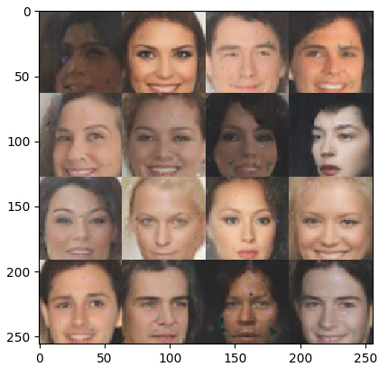

# BEGAN

### Prerequisites

- [CelebA Dataset](http://mmlab.ie.cuhk.edu.hk/projects/CelebA.html) 
- Tensoflow 
- Matplotlib
- Numpy

## Getting Started

1. `git clone ` + repo URL
2. cd to repo
3. `pip install -r requirement.txt` if packages are not yet installed
4. Train model: `python train.py` downloads dataset if not present and trains the model

## Results

## Todo

1. Add skip connections Decoder
2. Implement latent space interpolation
2. Test GAN improvement techniques

## Built With

* [Tensoflow](https://www.tensorflow.org) - Software library for numerical computation using data flow graphs
* [Matplotlib](https://matplotlib.org) - Python 2D plotting library
* [Numpy](http://www.numpy.org) - package for scientific computing

## Contributing

1. Fork it! Star it?
2. Create your feature branch: `git checkout -b my-new-feature`
3. Commit your changes: `git commit -am 'Add some feature'`
4. Push to the branch: `git push origin my-new-feature`
5. Submit a pull request :D

## Authors

* **Udacity** - *Helper functions* - [Repo](https://github.com/udacity/deep-learning/tree/master/face_generation)
* **Jorge Ceja** - *Model implementations* - [Account](https://github.com/JorgeCeja)

## Acknowledgments

* BEGAN: Boundary Equilibrium Generative Adversarial Networks - [arXiv](https://arxiv.org/abs/1703.10717)
* Improved Training of Wasserstein GANs - [arXiv](https://arxiv.org/abs/1704.00028)
* Improved Techniques for Training GANs - [arXiv](https://arxiv.org/abs/1606.03498)